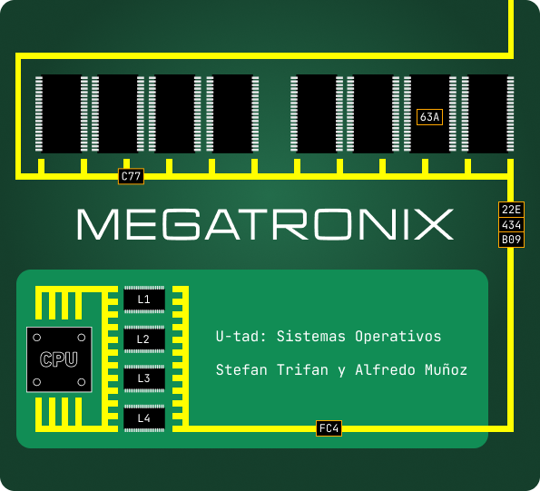

<p align="center">
  
</p>

# Proyecto Megatronix

**Stefan Trifan y Alfredo Muñoz**  
Sistemas Operativos · U‑tad · 2025

MEGATRONIX tenía un bus de memoria de 12 bits y usaba memoria física, con una caché de 8 líneas con correspondencia directa y 16 bytes por línea. Con lo que hemos aprendido en teoría, sabemos que la caché interpretará cada dirección de memoria recibida de la CPU en tres campos: palabra (4 bits), línea (3 bits) y etiqueta (5 bits).

---

Hay que desarrollar en `C` sobre Linux un proceso `MEMsym`. El proceso dispone de un array de `8` elementos, del tipo `T_CACHE_LINE`, cuya definición es:

```c
typedef struct 
{
    unsigned char ETQ;
    unsigned char Data[TAM_LINEA];
} 
T_CACHE_LINE;
```

El proceso tendrá una variable globaltime que inicializará a valor `0`. También creará otra con el nombre numfallos inicializada a `0`.

En el arranque, `MEMsym` inicializa a `xFF` (hexadecimal) los campos Label y a `x23` (hexa) todos los campos de datos de la caché. Luego lee el fichero binario `CONTENTS_RAM.bin` en la variable `Simul_RAM`, que es un array de `4096` `unsigned char`. A continuación, comienza la lectura del fichero de texto `dirs_memoria.txt` que contiene una lista de direcciones de memoria en hexadecimal, una por línea. El proceso tiene que tratar adecuadamente los errores si alguno de los ficheros no existe y avisar con el mensaje correspondiente. En ese caso terminará el proceso con `return(-1)`.

Se repetirá el siguiente protocolo:

- `MEMsym` lee una dirección del fichero `accesos_memoria.txt`.
- Obtiene el número de línea y comprueba si la etiqueta de la dirección es igual a `Label` de la línea de la caché.
- Si no es así, incrementa el valor de numfallos y escribe una línea con el texto `“T: %d, Fallo de CACHE %d, ADDR %04X Label %X linea %02X palabra %02X bloque %02X”`, siendo `T` el instante. Se incrementa en `20` el contador `globaltime`. Se copia el bloque correspondiente desde el array RAM y se imprime un mensaje indicando que se está cargando el `bloque X` en la `línea Y`. Se actualizan tanto el campo `Label` como los `16` bytes de datos de la línea.
- Por pantalla se escribe `“T: %d, Acierto de CACHE, ADDR %04X Label %X linea %02X palabra %02X DATO %02X”`. Cada carácter leído se añade a una variable llamada texto, que es un array de `100` caracteres como máximo (no hace falta usar memoria dinámica).
- El proceso vuelca el contenido de la caché por pantalla con el siguiente formato: Los datos se imprimen de izquierda a derecha de mayor a menor peso. Esto significa que el byte situado más a la izquierda es el byte 15 de la línea y el situado a la derecha el byte `0`.
- EL proceso hace un `sleep()` de `1` segundo.

Al final se imprimirá un mensaje con el número total de accesos, número de fallos y tiempo medio de acceso.

Debajo, otro mensaje con el texto leído carácter a carácter desde la caché.

Antes de salir, el programa volcará los contenidos de los 128 bytes de información (`8` líneas de `16` bytes cada una) de la caché en un fichero binario llamado `CONTENTS_CACHE.bin`. El byte `0` de ese fichero es el byte `0` de la línea `0` de la caché y el byte `128`, es el byte `15` de la línea `8`.

---

El proceso tendrá que desarrollar OBLIGATORIAMENTE las siguientes
funciones:

`void LimpiarCACHE(T_CACHE_LINE tbl[NUM_FILAS]);`

`void VolcarCACHE(T_CACHE_LINE *tbl);`

`void ParsearDireccion(unsigned int addr, int *ETQ, int *palabra, int *linea, int *bloque);`

`void TratarFallo(T_CACHE_LINE *tbl, char *MRAM, int ETQ, int linea, int bloque);`